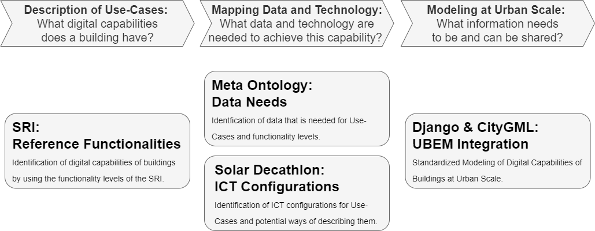
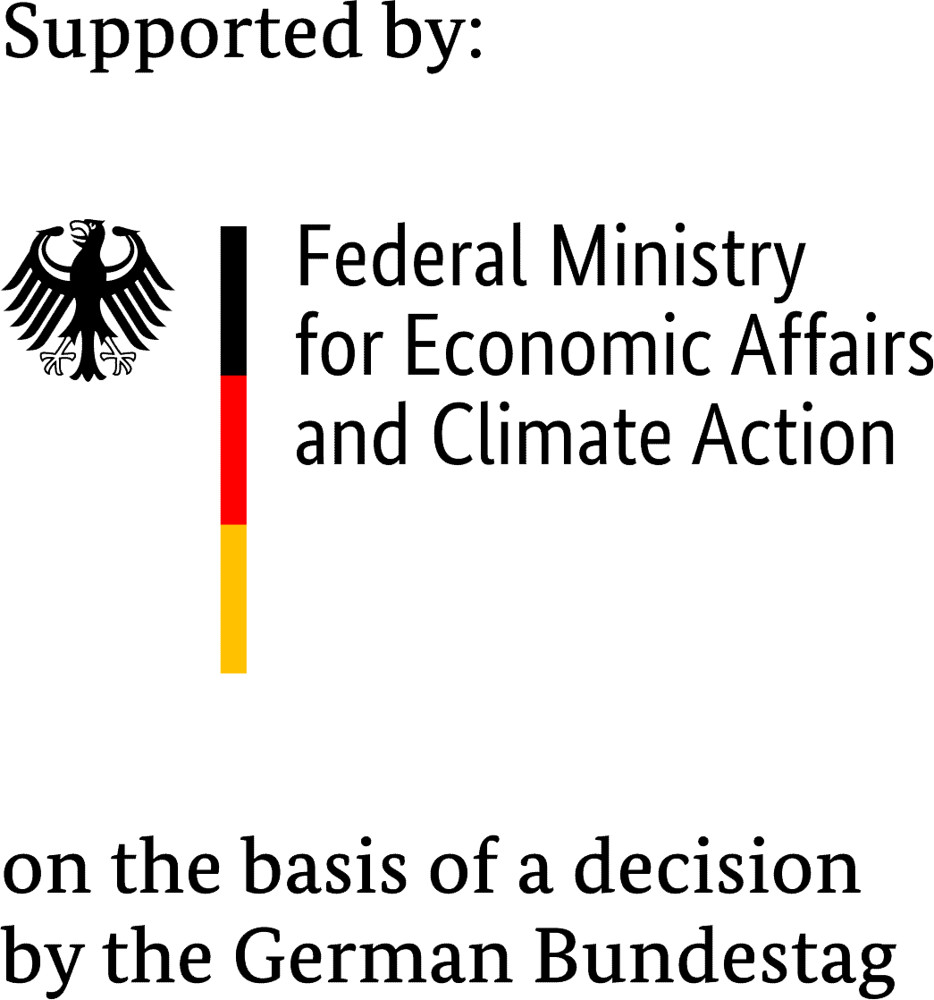

# djangoSRI

A conceptual, logical, and archetype data model for the [Smart Readiness Indicator (SRI)](https://energy.ec.europa.eu/topics/energy-efficiency/energy-efficient-buildings/smart-readiness-indicator_enr). The project extends **CityGML** via an **Application Domain Extension (ADE)** and integrates with **Django** to provide a REST API and GIS-based web application.

The concept is illustrated in the following figure:



## **Project Overview**

The project consists of four main components:

1. **SRI Data Model**: Defines the data structure for **SRI and functionality levels**.
2. **Digital Archetypes**: Predefined **building configurations** for different SRI levels.
3. **CityGML & 3DCityDB Extension**: Enhances **CityGML with an ADE** for SRI.
4. **Django App & API**: Provides an **installable Django app** to manage and query SRI-related data.

# **CityGML & Django Integration**

## **Introduction**

`django-sri` is an **extension for CityGML and 3DCityDB**, allowing for the integration of **SRI-related data** into a Django-based environment. It is compliant with the **3DCityDB schema and ADE specifications**, and enables:

- **Storage of mapped SRI data and functionality levels**
- **REST API for querying CityGML objects with SRI extensions**
- **Django templates and static JavaScript for GIS-based web applications**

### **Requirements**
To run this app, you need:
- **PostgreSQL with PostGIS**
- **InfluxDB** *(for time-series data if required)*
- **Django environment**

As a reference for setting up dependencies, you can use **[vDistrict](https://github.com/TUB-DVG/vDistrict)**, which includes detailed installation instructions for databases and the Django environment.

---

## **Installation of django-sri as an installable Python package**

### **1. Clone the Repository**
```bash
git clone [SSH-Key/Https]
```

### **2. Install django-sri locally**
```bash
pip install -e [Path/to/your/django-sri/Clone]
```

### **3. Integrate into a Django Project**

Add `sridb` to your `INSTALLED_APPS` in **settings.py**:
```python
INSTALLED_APPS = [
    ...
    'sridb',
]
```

Include `sri` URLs in your **urls.py**:
```python
from django.urls import include, path
urlpatterns = [
    path('sridb/', include('sridb.urls')),
]
```

Run database migrations:
```bash
python manage.py migrate sridb
python manage.py migrate --fake-initial
```

Verify installation:
```bash
python manage.py runserver
```
Access at: **http://127.0.0.1:8000/sri/**

---

## **Archetype-Based Building Creation**
The `django-sri` module includes **archetype definitions** to automatically configure buildings based on their **SRI levels**.

### **Example: Creating a New Building Based on an Archetype**
```python
from sri.models import Building, SRILevel
from archetypes.archetypes import SRIArchetype

# Create a Residential Advanced Building
archetype = SRIArchetype("Residential", "Advanced")
new_building = archetype.create_building(building_id="B123", geometry="<gml:Point><gml:coordinates>13.4,52.5</gml:coordinates></gml:Point>")

new_building.save()
```

---

## **CityGML Generation with SRI ADE**
This module extends **CityGML** with an ADE for **SRI-related information**.

### **Generating CityGML for a Building**
```python
from citygml.generate_citygml import generate_citygml
citygml_data = generate_citygml("B123")
print(citygml_data)
```

---

## **Version**
This is version **0.1.0**.

---

## **How to Contribute?**
Thanks for contributing! Please follow our [contribution guide](./docs/contributor.md).

---

## **License**
This project is licensed under **MIT License**.

---

## **Acknowledgements**
`django-sri` has been developed within public-funded projects with financial support by **BMWk (German Federal Ministry for Economic Affairs and Climate Action)** and the **Institute for Energy Efficient Buildings and Indoor Climate**.



